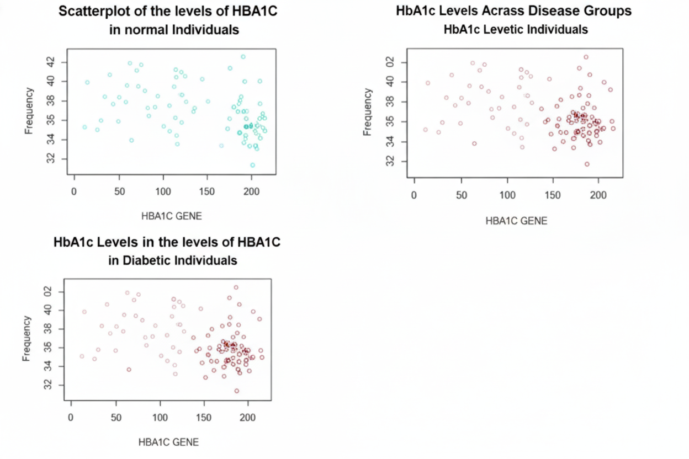

# Diabetes and Its Correlation with Genetic and Environmental Factors (R)

**Author:** Lamia T. Merhy  
**Institution:** Lebanese American University – Beirut, Lebanon  
**Tools:** R (ggplot2, dplyr, readr)  
**Dataset:** Kaggle – [Human Metagenomics for Diabetes (Stool Subset)](https://www.kaggle.com/datasets/rwilliams7653/eda-of-human-metagenomics-for-diabetes)

---

## Overview
This project explores how **genetic, biochemical, and environmental factors** interact in the development of **Type 2 Diabetes (T2D)**.  
Using R, the analysis investigates relationships between **HbA1c levels (genetic marker)**, **cholesterol (biochemical marker)**, and **gut microbiota composition (environmental factor)** — particularly the abundance of *Roseburia* and *Clostridium bolteae* — across diabetic, prediabetic, and healthy individuals.

---

## Objectives
- Examine how cholesterol levels differ between diabetic and non-diabetic individuals.  
- Analyze HbA1c variations across disease groups to understand its predictive strength.  
- Compare bacterial abundance (*Roseburia* and *Clostridium bolteae*) as environmental correlates of diabetes.  
- Summarize biostatistical insights relevant to diabetes progression and early detection.

---

## Methodology
1. **Data Import & Cleaning**  
   - Filtered relevant samples (`t2dmeta_long`, `t2dmeta_short`, `WT2D`) from the Kaggle stool subset dataset.  
   - Selected variables: `dataset_Name`, `age`, `gender`, `disease`, `country`, `hba1c`, `cholesterol`, *Roseburia*, and *Clostridium bolteae*.

2. **Exploratory Data Analysis (EDA)**  
   - Created histograms, scatterplots, and boxplots to visualize feature distributions.  
   - Computed summary statistics (mean, variance, standard deviation).  

3. **Correlation & Regression Analysis**  
   - Performed simple linear regression between HbA1c and disease type.  
   - Compared mean cholesterol and bacterial abundance across categories.

4. **Visualization**  
   - Visualized HbA1c and microbiota distributions using `ggplot2`.  
   - Exported high-resolution PNGs for reproducibility and documentation.

---

## Key Findings
- **HbA1c** levels were significantly higher in diabetic individuals, confirming its reliability as a genetic indicator of T2D.  
- **Cholesterol** showed minimal variation between groups, suggesting limited diagnostic utility alone.  
- **Roseburia** abundance tended to be higher in healthy controls, consistent with its reported anti-inflammatory effects and role in maintaining gut homeostasis.  

---

## Example Visualizations
| Plot | Description |
|------|--------------|
|  | HbA1c levels across disease categories (diabetic, prediabetic, normal). |
|  | Boxplot showing *Roseburia* relative abundance by disease group. |

---

## Tools & Libraries
- **Programming Language:** R (version 4.x)  
- **Libraries:** `ggplot2`, `dplyr`, `readr`  
- **Environment:** RStudio 2022  
- **Data Source:** Kaggle – *Human Metagenomics for Diabetes (Stool Subset)*

---

## Files Included
| File | Description |
|------|--------------|
| `diabetes_analysis.Rmd` | Full R Markdown analysis with code, figures, and narrative. |
| `Diabetes_Analysis_Report.pdf` | Final formatted report containing all results and interpretation. |
---

## Notes
This repository includes the **original R Markdown (`diabetes_analysis.Rmd`)** and **final report (`Diabetes_Analysis_Report.pdf`)**.  
The project was originally developed and executed in **RStudio (2022)**.  
Due to environment changes, R is not currently installed on the system used for this upload — therefore, the code was **not re-run** at this time.  
All figures and results reflect the original verified analysis.

---

## Citation
> Merhy, L. (2022). *Diabetes and Its Correlation with Genetic and Environmental Factors.* Lebanese American University, Beirut.

## 🧠 Keywords
R Programming · Biostatistics · Type 2 Diabetes · Gut Microbiome · HbA1c · Cholesterol · Data Visualization · Bioinformatics
